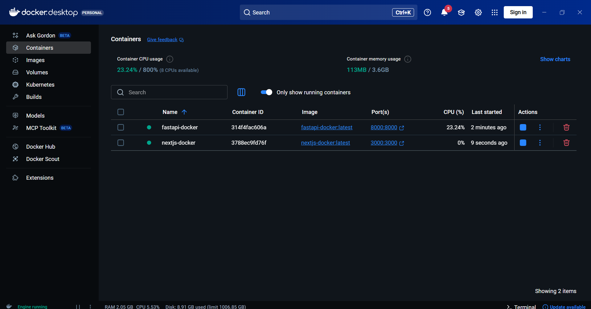

# Class 13 Assignment - January 04
## Assignment: Docker Containerization




## Project Overview

This repository contains two containerized applications demonstrating Docker usage with different technology stacks:

1. **Next.js Docker** - A React-based web application running on Node.js
2. **FastAPI Docker** - A Python-based REST API application

## Part 1: Next.js Docker Application

### Project Structure
- Directory: `nextjs-docker/`
- Framework: Next.js 16.1.1 with React 19.2.3
- Dependencies: Next.js, React, React DOM, Tailwind CSS, TypeScript
- Port: 3000

### Docker Configuration
The Next.js application uses the following Dockerfile:

```dockerfile
# Install nodejs version 22
FROM node:22-alpine

# Set working directory means (where the commands will be executed)
WORKDIR /app

# Copy package.json and package-lock.json to working directory
COPY package*.json ./

# Install depedencies
RUN npm install

# Copy all files to working directory
COPY . .

# Build the project
RUN npm run build

# Application access port, localhost:3000 or 127.0.0.1:3000
EXPOSE 3000

# Run the application
CMD ["npm", "start"]
```

### Build & Run Instructions

```bash
# Navigate to the nextjs-docker directory
cd nextjs-docker

# Create docker image
docker build -t nextjs-docker .

# Run docker container
docker run -p 3000:3000 nextjs-docker
```

Access the application at [http://localhost:3000](http://localhost:3000)

### Alternative: Run in Detached Mode
```bash
# Run container in detached mode (background)
docker run -d -p 3000:3000 --name nextjs-container nextjs-docker
```

## Part 2: FastAPI Docker Application

### Project Structure
- Directory: `fastapi-docker/`
- Framework: FastAPI 0.128.0
- Language: Python 3.12
- Dependencies: FastAPI with standard packages, uv package manager
- Port: 8000

### Main Application Code (`main.py`)
```python
from fastapi import FastAPI

app = FastAPI()

@app.get("/")
def read_root():
    return {"message": "Hello from FastAPI Docker!"}
```

### Docker Configuration
The FastAPI application uses the following Dockerfile:

```dockerfile
# Install python version 3.12
FROM python:3.12-slim

# Set working directory means (where the commands will be executed)
WORKDIR /app

# Copy all files to working directory
COPY . .

# Install uv using pip
RUN pip install uv

# Install all dependencies in a project
RUN uv sync

# Application access port, localhost:8000 or 127.0.0.1:8000
EXPOSE 8000

# Run the application
CMD ["uv", "run", "fastapi", "dev", "main.py", "--host", "0.0.0.0"]
```

### Build & Run Instructions

```bash
# Navigate to the fastapi-docker directory
cd fastapi-docker

# Create docker image
docker build -t fastapi-docker .

# Run docker container
docker run -p 8000:8000 fastapi-docker
```

Access the application at [http://localhost:8000](http://localhost:8000)

### Alternative: Run in Detached Mode
```bash
# Run container in detached mode (background)
docker run -d -p 8000:8000 --name fastapi-container fastapi-docker
```

## Useful Docker Commands

```bash
# List all images
docker images

# List all containers (running and stopped)
docker ps -a

# Stop a running container
docker stop <container-id>

# Remove an image
docker rmi <image-id>

# Remove a container
docker rm <container-id>

# View logs of a container
docker logs <container-id>

# Build image with custom tag
docker build -t <image-name> .

# Run container in detached mode
docker run -d -p <host-port>:<container-port> <image-name>

# Remove all unused containers, networks, images
docker system prune

# Execute commands inside a running container
docker exec -it <container-id> sh

# Check container resource usage
docker stats
```

## Development Workflow

### Building Images
Both projects can be built using the standard Docker build process:

1. Navigate to the project directory
2. Run `docker build -t <project-name> .`
3. The image will be created with all dependencies installed

### Running Containers
After building the images, you can run containers with port mapping to access the applications locally:

- Next.js app: Map host port 3000 to container port 3000
- FastAPI app: Map host port 8000 to container port 8000

## Project Files

### Next.js Project Files
- `Dockerfile` - Container configuration
- `package.json` - Dependencies and scripts
- `package-lock.json` - Locked dependency versions
- `next.config.ts` - Next.js configuration
- `tsconfig.json` - TypeScript configuration
- `eslint.config.mjs` - ESLint configuration
- `pages/`, `components/`, `public/` - Application source code

### FastAPI Project Files
- `Dockerfile` - Container configuration
- `main.py` - FastAPI application entry point
- `pyproject.toml` - Python project metadata and dependencies
- `uv.lock` - Locked dependency versions
- `.python-version` - Python version specification

**Build with ❤️ by Afaq Ul Islam.**